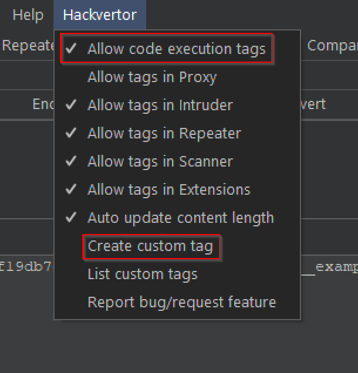

# Hackvertor Custom Tags Playbook

[Hackvertor](https://github.com/hackvertor/hackvertor) is a great tag based conversion tool as a Burp Suite extension. Hackvertor tags can help users dynamically generate input based content that could be used within Burp Suite. Common use cases include random numbers, time stamps and text encoding generation. These use cases are covered by the tool right out of the box.

Additionally, Hackvertor allows users to extend its functionality through the creation of custom tags. A typical use case for custom tags is when a user needs to submit a dynamically generated authorization header based on numerous parameters of a web request.

Unfortunately, the author of Hackvertor has little to no documentation for the tool, especially for the custom tag functionality. Documentation on this feature is scattered all over the internet on personal blogs, Twitter and other social media posts. It is this playbook's intent to cover the requirements for a custom tag creation through a real world use case.

## Pre-Requisites

Install the Hackvertor plugin from the Burp Suite BApp store.

## Workflow

Creating a custom tag for Hackvertor is relatively easy however, the lack of official documentation has made it a challenging process. To create a custom tag, in Burp, click the Hackvertor top level drop down menu and select *Create custom tag*. While we're there, we're also going to select *Allow code execution tags*. Custom tag execution is disabled by default as a security measure as there is the potential for arbitrary code execution.




### Form Fields

The custom tag form has various fields, some of which are required. The form also has variables we can use. 

- *Tag name* - A custom tag name must always start with an underscore. This tells Hackvertor to treat the tag as a custom tag and not a predefined Hackvertor tag.

- *Select language* - Here we specify what language we want to write our custom tag in. As of this writing, the supported languages are *JavaScript*, *Python*, *Java* and *Groovy*.

- *Argument1 and Argument2* - Optional. If we want to pass arguments to the custom tag, we must specified the type of the argument here. The choices are *None*, if we're not passing an argument, *String* and *Number*.

- *Param Name* - Optional. This is the name of the variable that will hold the value of the argument passed to the custom tag.

- *Default value* - Optional. Default value if no argument value is passed to the custom tag. 

- *Code* - This is where we specify the code we want our custom tag to execute.

### Form Variables

There are two variables that are implicitly created and available to the context of the custom tag code; `input` and `output`.

- `input` - This is the string input passed to the custom tag, not to be confused with arguments.
- `output` - This variable holds the text output that we want our custom tag to return.

In the example below, we have named our custom tag `_example`, passed two string arguments to it, concatenated both arguments to the upper-cased `input` variable and assigned it to the `output` variable. 


### Execution

To test our created sample custom tag, we simply go to the Hackvertor tab, select *Custom* then click on the `_example` tag. We then pass values to the two arguments we created along with a value for the input, as shown below:


Note: The third parameter passed to the custom tag is called the code execution tag id. This value is automatically generated for custom tags and it changes every time Burp reloads. Keep in mind this value must be updated wherever custom tags are used in Burp whenever it reloads.

## Real World Use Case

The real beauty of Hackvertor custom tags lie in the power to leverage powerful programming languages to  compute anything we might need in a dynamically changing web context. We can see a typical real world use case when we need to generate a dynamically changing authentication header, for example.

### The MasterCard Challenge

In the MasterCard program I faced a challenge where I needed to test a web service that required a dynamically generated OAuth signature as a header. The good news was that MasterCard had public stand-alone code libraries that could be leveraged to generate this oAuth signature; [here](https://github.com/Mastercard/oauth1-signer-java). The bad news was I needed to figure out a way to easily call these libraries from Burp. Fortunately, Hackvertor custom tags was the answer.

### Tips

*Tip #1* - The Hackvertor custom tag form allows us to type all our tag execution code in the code field however, it is recommended to reference an external code file. This allows us to simply modify the code in the file, save it and Hackvertor will automatically reload it.

*Tip #2* - Python works well as the programming language of choice however, we start to run into problems and Hackvertor limitations when we need to import external libraries; typically the case when doing cryptography work. For this reason, I recommend a hybrid approach where we can leverage Python to call self-contained external libraries.

*Tip #3* - Hackvertor recently implemented the concept of global variables. This allows you to share variables across Hackvertor instances. This also allows you to not be constrained to only two parameters per custom tag. Now, we can pass virtually any number of variables. 

To set a global variable: ```<@set_myGlobal('true')>my value<@/set_myGlobal>```

To read a global variable anywhere in Burp: ```<@get_myGlobal/>```

To read a global variable in code: ```myGlobal```

### The Solution

This challenge required me to generate an oAuth signature based on a total of six parameters, and conditionally a seventh in the case of web methods passing a request body like a POST or a PUT. For this, I encapsulated all the logic in a Java class that took all the parameters via command line arguments and compiled it into an executable Jar file.

```java
package com.bf.authsigner;

import com.mastercard.developer.oauth.OAuth;
import com.mastercard.developer.utils.AuthenticationUtils;
import java.io.IOException;
import java.net.URI;
import java.nio.charset.Charset;
import java.nio.charset.StandardCharsets;
import java.security.PrivateKey;
import java.util.Base64;

/**
 *
 * @author ealvarez
 */
public class AuthSigner 
{

    public static void main(String[] args) throws Exception 
    {
        String certPath = args[0].trim();
        String keyAlias = args[1].trim();
        String keyPass = args[2].trim();
        PrivateKey signingKey = AuthenticationUtils.loadSigningKey(
                                    certPath, 
                                    keyAlias, 
                                    keyPass);
        String consumerKey = args[3].trim();
        
        URI uri = URI.create(args[4].trim());
        String method = args[5].trim();
        
        String payload;
        
        if(args.length < 7) //No payload, it is a GET or DELETE
            payload = null;
        else
            payload = new String(Base64.getDecoder().decode(args[6].trim())); //payload is b64 encoded so we need to decode it
            
        Charset charset = StandardCharsets.UTF_8;
        String authHeader = OAuth.getAuthorizationHeader(uri, method, payload, charset, consumerKey, signingKey);
        
        System.out.print(authHeader);
    }
}
```
Next, I wrote a Python harness that would read-in certain Hackvertor variables, load needed secrets and call the executable jar file via command line which returned our oAuth signature.

```python
import subprocess
from base64 import (b64encode, b64decode) 

scheme = "https://"
tokens = str(method_url).split(" ")
method = tokens[0]
url = tokens[1]
URI = str(scheme+host+url)
jar = str("path/to/AuthSigner-1.0-SNAPSHOT-jar-with-dependencies.jar")
cert = str("path/to/SigningKey103_DoNotDelete.p12")
keyAlias = str("alias")
passwd = str("password")
consumerKey = str("consumerkey")

if 'body' in dir():
    bodyb64 = b64encode(body.encode('utf-8'))
    args = [jar, cert, keyAlias, passwd, consumerKey, URI, method, bodyb64.decode('utf-8')]
else:
    args = [jar, cert, keyAlias, passwd, consumerKey, URI, method]

output = subprocess.Popen(['java', '-jar']+list(args), stdout=subprocess.PIPE).stdout.read()
``` 

### Putting It All Together

We now create a new custom tag that would reference our Python harness.


Next we generate our custom tag by visiting the Hackvertor tab and under custom, we click the name of our tag.

```text
<@___mcAuthHeader('d6d595afc8ee9f19db7e4e936c5f0637')><@/___mcAuthHeader>
```

This tag is now ready to be used in any Burp web request pane like the Repeater tab. 

We then place the custom tag in the Authorization header that would generate the oAuth signature and instantiate the global variables the tag needs, as shown below:

```html
<@set_method_url('true')>POST /srci/onboarding/org/4c40a1a9-c88c-4074-8e73-e939eaf2cd70/dpas/batch<@/set_method_url> HTTP/1.1
Host: <@set_host('true')>stage.api.mastercard.com<@/set_host>
...Omitted for brevity...
Content-Type: application/json
Authorization: <@___mcAuthHeader('d6d595afc8ee9f19db7e4e936c5f0637')><@/___mcAuthHeader>
User-Agent: Mozilla/5.0 (Windows NT 10.0; Win64; x64) AppleWebKit/537.36 (KHTML, like Gecko) Chrome/102.0.0.0 Safari/537.36
Accept: text/html,application/xhtml+xml,application/xml;q=0.9,image/avif,image/webp,image/apng,*/*;q=0.8,application/signed-exchange;v=b3;q=0.9
Accept: */*
Content-Length: 1785

<@set_body('true')>{
    "dpas": [
        {
            "supportedCardBrands": [
                "Mastercard"
            ],
            "dpaData": {
                "dpaName": "DpaName_BFX_001_BFTesting",
                "dpaPresentationName": "DpaPresentationName_BFX_001_BFTesting/>",
                ...Omitted for brevity...
            },
            ...Omitted for brevity...
        }
    ]
}<@/set_body>
```

Once a request is submitted, Hackvertor will intercept the request, interpret the custom tag and call our Python harness which in turn executes the jar file and returns our oAuth signature. We can see the generated signature in the Burp Logger tab:


## Resources

- [GitHub - Hackvertor](https://github.com/hackvertor/hackvertor)
- [A Guide For Advanced Message Protected API Hacking Using Hackvertor and Burp (part 2)](https://michael-yer.medium.com/a-guide-for-advanced-message-protected-api-hacking-using-hackvertor-and-burp-part-2-76483c1af535)
- [Twitter - Hackvertor Global Variables](https://twitter.com/garethheyes/status/1541836601747292160?s=20&t=7Y3b63GDelgPn1PT9u7VYQ)